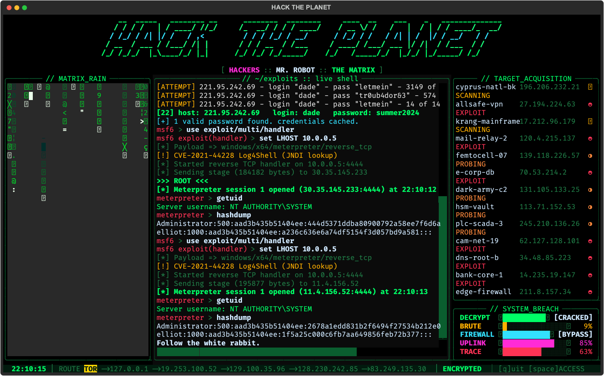
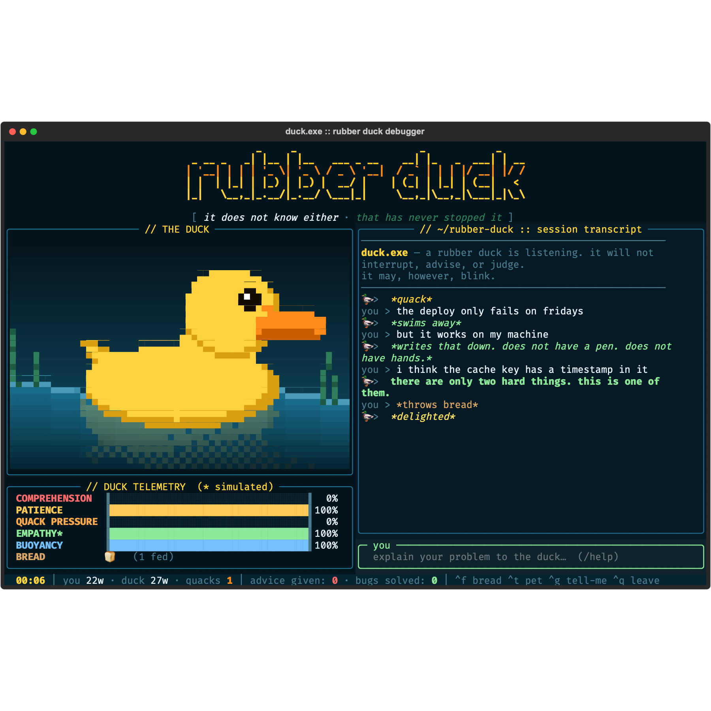
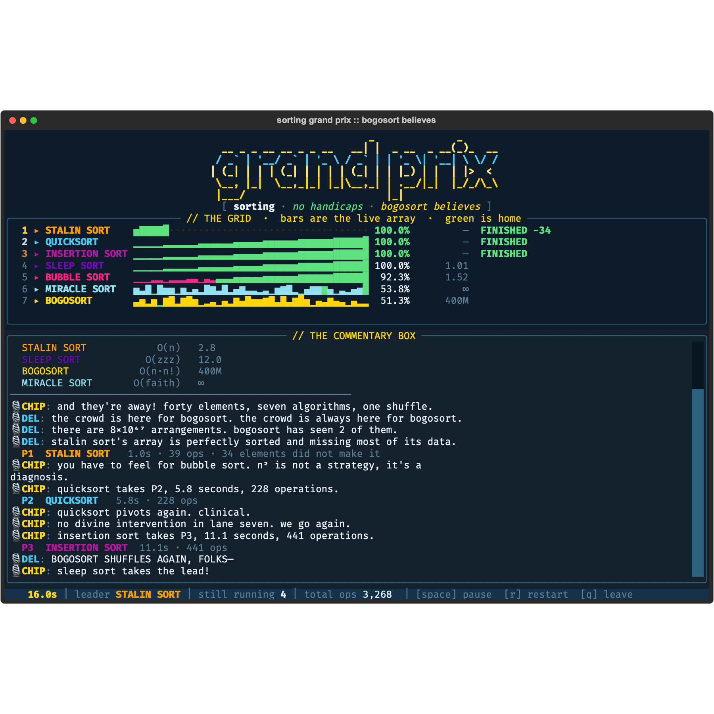

# HACK THE PLANET — a terminal extravaganza

A full-screen [Textual](https://textual.textualize.io) TUI that mashes up the
neon swagger of **Hackers (1995)**, the grounded terminal realism of
**Mr. Robot**, and the green digital rain of **The Matrix**.



## What's on screen

- **Banner** — a `HACK THE PLANET` figlet header in a green→cyan gradient.
- **MATRIX_RAIN** — half-width katakana cascading with bright leading drops,
  rendered through Textual's Line API so it stays smooth.
- **Live shell** — a scrolling exploit console that cycles through scripted
  scenes: `nmap` service scans, `hydra` brute force, a Metasploit/meterpreter
  session + `hashdump`, encrypted exfil, plus Matrix/Hackers easter eggs.
- **TARGET_ACQUISITION** — a kill list of nodes marching
  `SCANNING → PROBING → EXPLOIT → BREACHED → ROOTED`.
- **SYSTEM_BREACH** — self-animating neon gauges (DECRYPT / BRUTE / FIREWALL /
  UPLINK / TRACE) that fill, flash a verdict, and reset.
- **Status bar** — clock, a Tor-style routing hop chain, and a blinking cursor.

## Run it

```sh
python3 -m venv venv && source venv/bin/activate
pip install -r requirements.txt
python hack.py
```

## Keys

| key     | action                                   |
|---------|------------------------------------------|
| `q`     | disconnect (quit)                        |
| `space` | full-screen `ACCESS GRANTED` flash       |
| `m`     | mute/unmute the Matrix rain              |

The dramatic flash also fires on its own every ~17 seconds. Best enjoyed
full-screen with the lights off. Hack responsibly — it's all theatre.

---

# 🦆 duck.exe — the rubber duck debugger

A full-screen [Textual](https://textual.textualize.io) TUI containing one (1)
rubber duck. You type your problem at it. It floats, blinks, tilts its head,
and says "go on." Some minutes later you have fixed your bug and the duck has
said nothing of substance. This is the intended outcome.



## What's on screen

- **THE DUCK** — pixel art rendered through Textual's Line API at double
  vertical resolution (`▀` with a foreground and a background per cell), so the
  duck is drawn in square-ish pixels rather than character soup. It bobs on a
  sine-wave surface, casts a wobbling reflection that dissolves with depth, and
  is flanked by reeds swaying out of time with each other. It blinks on its own.
  It scales to whatever pane you give it.
- **Session transcript** — what you said, what the duck said back.
- **DUCK TELEMETRY** — `COMPREHENSION` (0%), `PATIENCE` (drains when you
  ramble, recovers when you get to the point), `QUACK PRESSURE` (builds in
  silence; when it tops out the duck says something unprompted), plus `EMPATHY`
  and `BUOYANCY`, both pinned at 100%, one of them honestly.
- **Status bar** — word counts, quacks, bugs solved, and advice given.

## Run it

Same venv as `hack.py` — no extra dependencies.

```sh
python3 -m venv venv && source venv/bin/activate
pip install -r requirements.txt
python duck.py
```

## Keys

| key                | command  | action                               |
|--------------------|----------|--------------------------------------|
| `enter`            |          | say it out loud                      |
| `ctrl+f` / `ctrl+b`| `/bread` | throw bread                          |
| `ctrl+t`           | `/pet`   | pet the duck                         |
| `ctrl+g`           | `/tell`  | demand it just tell you what's wrong |
|                    | `/help`  | list all of this in the transcript   |
| `ctrl+q`           |          | leave the duck                       |

Your hands are already in the input box, so everything has a typed command too.

The obvious keys were taken: `ctrl+p` is Textual's command palette, `ctrl+j` is
aliased to `newline` (which your terminal sends as LF), and `ctrl+b` is tmux's
prefix — so bread answers to `ctrl+f` as well, for anyone inside tmux.

## The duck's method

Mostly it makes a noise. Sometimes it asks the one question you were avoiding —
*"what did you expect to happen?"*, *"what changed?"*, *"did you save the
file."* It never answers anything.

It does, however, recognise roughly thirty topics and has been through each of
them before. Mention DNS and it will tell you it is DNS. Mention a regex and it
will note that you now have two problems. Mention deploying on a Friday and it
swims away.

When you type the words that mean you've got it — *oh*, *wait*, *of course*,
*found it* — the duck notices, the screen flashes **BUG SOLVED**, and the
counter reads `advice given: 0`. That counter is not a joke. It is wired to a
variable that is never incremented, because the duck has never once helped and
you have solved every bug in here yourself.

`EMPATHY` is marked simulated. Bread is bad for real ducks; this one is rubber,
so it's fine.

---

# 🏁 race.py — the Sorting Grand Prix

Seven sorting algorithms, one shuffled array each, no handicaps. Every racer
gets exactly the same number of operations per tick, so the finishing order is
the real complexity class, live, in front of a paying crowd.



Nothing here is animated theatre: each racer is a generator that yields once per
operation and mutates its own list in place, and the bars in each lane **are**
that list. Green bars are elements already in their final position, so you watch
quicksort's partitions snap into place while bubble sort walks the same ground
for the twentieth time.

## The field

| racer            | form       | how it ends                                        |
|------------------|------------|----------------------------------------------------|
| `QUICKSORT`      | O(n log n) | wins, clinically, in about 210 operations           |
| `INSERTION SORT` | O(n²)      | walks each element home, one at a time              |
| `BUBBLE SORT`    | O(n²)      | doing its best; n² is not a strategy, it's a diagnosis |
| `STALIN SORT`    | O(n)       | removes every out-of-order element and finishes first, with about four of the forty survivors |
| `SLEEP SORT`     | O(zzz)     | every element sleeps proportionally to itself, then reports |
| `BOGOSORT`       | O(n·n!)    | shuffles, checks, repeats, forever                  |
| `MIRACLE SORT`   | O(faith)   | checks whether the array has sorted itself. That is the entire algorithm. |

Stalin sort genuinely takes P1 in ~39 operations every time, and the commentary
box notes how many elements did not make it. Bogosort is quoted at 400M and
miracle sort at ∞, neither of which is generous enough. There are 8×10⁴⁷
arrangements of forty elements; the booth will tell you how many bogosort has
seen so far.

## Run it

Same venv as the others — no extra dependencies.

```sh
python race.py
```

| key     | action                          |
|---------|---------------------------------|
| `space` | red flag (pause)                |
| `r`     | new shuffle, new race           |
| `q`     | leave the paddock               |
